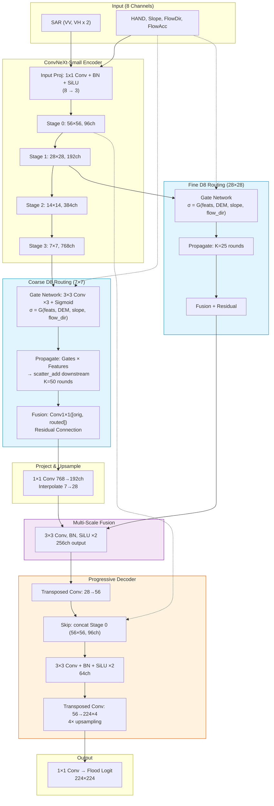

```mermaid
graph TD
    subgraph Input["Input (8 Channels)"]
        SAR["SAR (VV, VH x 2)"]
        TOPO["HAND, Slope, FlowDir, FlowAcc"]
    end

    subgraph Encoder["ConvNeXt-Small Encoder"]
        IP["Input Proj: 1x1 Conv + BN + SiLU<br>(8 → 3)"]
        S0["Stage 0: 56×56, 96ch"]
        S1["Stage 1: 28×28, 192ch"]
        S2["Stage 2: 14×14, 384ch"]
        S3["Stage 3: 7×7, 768ch"]
    end

    subgraph CoarseRouting["Coarse D8 Routing (7×7)"]
        G1["Gate Network: 3×3 Conv ×3 + Sigmoid<br>σ = G(feats, DEM, slope, flow_dir)"]
        P1["Propagate: Gates × Features<br>→ scatter_add downstream<br>K=50 rounds"]
        F1["Fusion: Conv1×1([orig, routed])<br>Residual Connection"]
    end

    subgraph UpProj["Project & Upsample"]
        UP["1×1 Conv 768→192ch<br>Interpolate 7→28"]
    end

    subgraph FineRouting["Fine D8 Routing (28×28)"]
        G2["Gate Network<br>σ = G(feats, DEM, slope, flow_dir)"]
        P2["Propagate: K=25 rounds"]
        F2["Fusion + Residual"]
    end

    subgraph Fusion["Multi-Scale Fusion"]
        FS["3×3 Conv, BN, SiLU ×2<br>256ch output"]
    end

    subgraph Decoder["Progressive Decoder"]
        D1["Transposed Conv: 28→56"]
        SKIP["Skip: concat Stage 0 (56×56, 96ch)"]
        D2["3×3 Conv + BN + SiLU ×2<br>64ch"]
        D3["Transposed Conv: 56→224×4<br>4× upsampling"]
    end

    subgraph Output["Output"]
        HEAD["1×1 Conv → Flood Logit<br>224×224"]
    end

    SAR --> IP
    TOPO --> IP
    IP --> S0 --> S1 --> S2 --> S3

    S3 --> G1
    TOPO -.-> G1
    G1 --> P1 --> F1

    F1 --> UP --> FS
    
    S1 --> G2
    TOPO -.-> G2
    G2 --> P2 --> F2 --> FS
    
    FS --> D1 --> SKIP --> D2 --> D3
    S0 -.-> SKIP
    
    D3 --> HEAD
    
    style CoarseRouting fill:#e1f5fe,stroke:#0288d1
    style FineRouting fill:#e1f5fe,stroke:#0288d1
    style Fusion fill:#f3e5f5,stroke:#7b1fa2
    style Decoder fill:#fff3e0,stroke:#e65100
```
